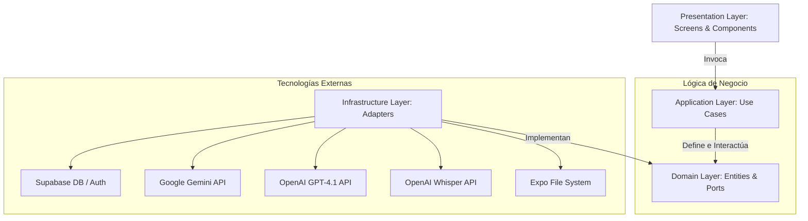

# Tutor Inteligente / AulaIA 📚🤖

¡Bienvenido a **Tutor Inteligente / AulaIA**! Esta es una aplicación móvil desarrollada en **React Native + Expo** diseñada para ayudar a estudiantes y docentes a registrar materias, subir/grabar audios de clase, generar transcripciones limpias, resúmenes estructurados automáticos y consultar a un tutor virtual mediante un chat contextualizado.

El sistema implementa una **Arquitectura Hexagonal (Puertos y Adaptadores)** para aislar la lógica de negocio de los proveedores externos de bases de datos (Supabase) e Inteligencia Artificial (Google Gemini, OpenAI GPT, Whisper).

---

## 🧭 Tabla de Contenido
1. [¿Qué es el Proyecto y su Propósito?](#-qué-es-el-proyecto-y-su-propósito)
2. [Arquitectura Hexagonal (Estructura de Carpetas)](#-arquitectura-hexagonal-estructura-de-carpetas)
3. [Flujos Principales del Sistema](#-flujos-principales-del-sistema)
4. [Catálogo y Router de Modelos IA](#-catálogo-y-router-de-modelos-ia)
5. [Mapeo de Pantallas y Botones](#-mapeo-de-pantallas-y-botones)
6. [Instalación y Configuración](#-instalación-y-configuración)
7. [Base de Datos (Supabase + PostgreSQL)](#-base-de-datos-supabase--postgresql)
8. [¿Qué es y cómo funciona un README completo?](#-qué-es-y-cómo-funciona-un-readme-completo)

---

## 🎯 ¿Qué es el Proyecto y su Propósito?

**Tutor Inteligente / AulaIA** es una plataforma de apoyo académico que digitaliza y optimiza el proceso de aprendizaje. Sus propósitos fundamentales son:
- **Automatizar apuntes**: Transformar la explicación verbal de una clase en resúmenes estructurados listos para estudiar.
- **Tutoría Personalizada**: Permitir a los alumnos chatear con una IA que conoce exactamente lo que se habló en una clase específica, resolviendo dudas sin alucinaciones y citando el contenido real.
- **Colaboración**: Compartir materias o aulas completas mediante códigos o códigos QR para que varios integrantes (estudiantes, profesores, administradores) colaboren en la misma materia.
- **Privacidad desde el diseño**: Limpiar automáticamente datos sensibles (contraseñas, correos, información personal) antes de enviarlos a modelos de IA comerciales.

---

## 🏛️ Arquitectura Hexagonal (Estructura de Carpetas)

El proyecto se estructuró de tal manera que el núcleo del negocio no dependa directamente de ninguna librería o framework externo (como Expo, React Native, Supabase o las APIs de OpenAI y Google).

### Estructura de Directorios

```txt
src/
├── domain/
│   ├── entities/        # Entidades puras del negocio (ej. Subject, AudioNote, User)
│   └── ports/           # Interfaces y contratos que definen la comunicación externa
│
├── application/
│   ├── usecases/        # Casos de uso específicos (ej. ProcessAudioNoteUseCase, AskTutorUseCase)
│   ├── container.ts     # Inyección de dependencias (une puertos con adaptadores)
│   └── promptBuilders.ts # Estructuración de instrucciones para los modelos de IA
│
├── infrastructure/
│   ├── supabase/        # Adaptadores de base de datos, autenticación y storage
│   ├── ai/              # Adaptadores de Gemini, GPT, Whisper y router de modelos
│   ├── privacy/         # Adaptador del filtro de privacidad (RegexPrivacyFilter)
│   └── expo/            # Adaptador para leer archivos locales del dispositivo
│
└── presentation/        # Pantallas, navegación y componentes React Native
    ├── screens/         # Vista final (LoginScreen, HomeScreen, ResumenScreen, etc.)
    ├── navigation/      # Navegadores y rutas de navegación de la app
    └── components/      # Componentes UI reutilizables
```

### 🔄 Diagrama de Flujo Hexagonal



### 🗣️ Frase para Defender la Arquitectura (Sustentación Académica/Profesional)
> *"Aplicamos arquitectura hexagonal porque el núcleo del negocio no debe verse afectado por cambios en los proveedores de base de datos o de Inteligencia Artificial. El core se concentra exclusivamente en estructurar la lógica de clase, mientras que las tecnologías como Supabase, Gemini, OpenAI o Expo se aíslan como adaptadores intercambiables. Esto nos permite cambiar de proveedor de base de datos o de IA en minutos sin modificar una sola línea de código de nuestra lógica de negocio."*

---

## 🔄 Flujos Principales del Sistema

### 1. Procesamiento de Audio y Generación de Apuntes
1. **Selección/Grabación**: El usuario graba audio en tiempo real desde la aplicación (usando `expo-av`) o sube un archivo local.
2. **Lectura**: El adaptador `ExpoFileReaderAdapter` lee el archivo y lo convierte a formato base64.
3. **Transcripción**: El adaptador `WhisperTranscriptionAdapter` (o Mock en su defecto) transcribe el audio a texto.
4. **Filtro de Privacidad**: El `RegexPrivacyFilter` analiza la transcripción y remueve datos sensibles (correos, contraseñas, teléfonos, IDs) de forma silenciosa para proteger la privacidad del usuario.
5. **Decisión del Modelo**: El `AIModelRouter` evalúa el tipo de clase/materia y selecciona el modelo de IA óptimo (Gemini Flash para teoría, GPT-4.1 mini para matemáticas/fórmulas).
6. **Estructuración**: La IA genera un resumen estructurado (título, resumen general, conceptos clave, posibles preguntas de examen, tareas detectadas, fechas de entrega, recomendaciones).
7. **Guardado**: Se registra el apunte en la base de datos de Supabase en la tabla `audios`.

### 2. Chatbot Contextual Directo (Sin Embeddings)
Para evitar el alto consumo de tokens de embeddings vectoriales y fallos de infraestructura, el sistema utiliza un **flujo de contexto directo**:
1. El usuario selecciona la **Materia** y la **Clase/Tema** específica sobre la que desea preguntar.
2. La aplicación recupera directamente el resumen estructurado y la transcripción limpia de esa clase en particular.
3. El `AskTutorUseCase` construye un prompt contextual inyectando esta información junto al historial reciente de mensajes.
4. El modelo asignado por el `AIModelRouter` responde basándose única y exclusivamente en los datos de esa clase seleccionada, lo que previene alucinaciones y da respuestas de alta precisión.

### 3. Sistema de Colaboración e Integrantes (QR & Enlace)
- **Invitaciones**: Los dueños o administradores de una materia pueden generar códigos de invitación reutilizables.
- **Acceso Directo por QR o Enlace**: Se genera un código QR usando `react-native-qrcode-svg` y un enlace tipo URI schema `aulaia://join?token=...`.
- **Integración**: Cualquier estudiante puede escanear el QR o ingresar el enlace en `JoinSubjectScreen` para unirse instantáneamente.
- **Roles**: Se implementa un control de acceso basado en roles dentro de `subject_members`:
  - `owner`: Creador de la materia (tiene control absoluto).
  - `admin`: Puede gestionar integrantes e invitar amigos.
  - `teacher`: Puede gestionar apuntes, audios y clases.
  - `student`: Solo lectura de resúmenes y chat.

---

## 🤖 Catálogo y Router de Modelos IA

El sistema cuenta con un ruteador inteligente de modelos (`AIModelRouter`) que aprovecha las fortalezas individuales de cada proveedor:

* **Google Gemini 2.5 Flash**: Seleccionado para clases teóricas, resúmenes conceptuales, resúmenes rápidos y organización de apuntes teóricos.
* **OpenAI GPT-4.1 mini / Modo Light**: Utilizado para razonamiento matemático avanzado, resolución de fórmulas paso a paso e interpretación visual.
* **OpenAI Whisper**: Transcriptor especializado en convertir audios y grabaciones de voz ruidosas en texto estructurado.
* **Mock AI**: Un adaptador simulador local para realizar pruebas de desarrollo completas sin necesidad de conexión a internet o de poseer API Keys activas.

---

## 📱 Mapeo de Pantallas y Botones

El sistema mapea las pantallas del prototipo de Figma e integra su funcionalidad real de la siguiente manera:

| Pantalla | Componente / Elemento | Acción / Backend Realizado |
| :--- | :--- | :--- |
| **Splash Screen** | `SplashScreen.tsx` | Muestra una animación de carga de 3 segundos mientras inicializa la conexión con Supabase y calibra el router de modelos de IA. |
| **Login / Acceso** | `LoginScreen.tsx` | Contiene tres estados: bienvenida, inicio de sesión y registro de usuario. El registro guarda el nombre y la universidad del estudiante en `public.profiles`. |
| **Home (Inicio)** | `HomeScreen.tsx` | Muestra el saludo personalizado con el nombre del usuario. Permite crear materias (modal con color, descripción y docente) e integra los botones de Editar, Eliminar y Amigos. |
| **Miembros** | `MembersScreen.tsx` | Permite gestionar a los integrantes de la materia, agregar por correo, definir roles y eliminar miembros o invitaciones pendientes. |
| **Resumen** | `ResumenScreen.tsx` | Muestra el listado de clases. Cada tarjeta permite ver el resumen estructurado, desplegar la transcripción literal o iniciar un chat específico para esa clase. |
| **Audio / Grabador**| `AudioScreen.tsx` | Permite grabar audio real en segmentos (iniciar, pausar, continuar, guardar) o subir archivos de audio del dispositivo mediante `expo-document-picker`. |
| **Chatbot** | `ChatbotScreen.tsx` | Permite chatear con el tutor virtual filtrando por clase y materia. Permite adjuntar imágenes, PDFs o audios que se suben al bucket `chat-uploads` de Supabase Storage. |

---

## 🚀 Instalación y Configuración

### Prerrequisitos
- Tener instalado [Node.js](https://nodejs.org/) (versión 18 o superior recomendada).
- Cuenta en [Supabase](https://supabase.com/).

### 1. Clonar e Instalar Dependencias
Instala los paquetes de Node y dependencias de Expo:
```bash
npm install
npx expo install expo-camera expo-av
npm install react-native-qrcode-svg
```

### 2. Configurar Variables de Entorno
Crea un archivo `.env` en la raíz del proyecto basándote en el siguiente formato:
```env
EXPO_PUBLIC_SUPABASE_URL=https://TU-PROYECTO.supabase.co
EXPO_PUBLIC_SUPABASE_ANON_KEY=TU_SUPABASE_ANON_KEY

# Modo simulación (dejar en true para probar sin APIs de IA)
EXPO_PUBLIC_USE_MOCK_AI=true

# Claves reales de Inteligencia Artificial (opcional)
EXPO_PUBLIC_GEMINI_API_KEY=TU_GEMINI_API_KEY
EXPO_PUBLIC_OPENAI_API_KEY=TU_OPENAI_API_KEY
EXPO_PUBLIC_OPENAI_MATH_MODEL=gpt-4.1-mini
EXPO_PUBLIC_OPENAI_TRANSCRIPTION_MODEL=gpt-4o-mini-transcribe
```

### 3. Ejecutar la Aplicación
Para ejecutar el servidor de desarrollo de Expo:
```bash
# Servidor de Expo normal
npx expo start -c

# En Windows (PowerShell) si tienes restricciones de ejecución de scripts:
npx.cmd expo start -c
```

### 4. Verificación de TypeScript
Puedes asegurarte de que el proyecto no contiene errores de tipos ejecutando:
```bash
npx tsc --noEmit
```

---

## 🗄️ Base de Datos (Supabase + PostgreSQL)

El backend de base de datos se ejecuta sobre Supabase. Para configurar las tablas y políticas de seguridad requeridas, dirígete a `Supabase -> SQL Editor -> New Query` y ejecuta los siguientes scripts en orden:

1. **`supabase/sql/001_setup_contexto_directo_colaborativo.sql`**: Configura las tablas iniciales de la aplicación (`profiles`, `subjects`, `audios`, `subject_members`, `subject_invites`, `session_files`), políticas RLS (Row Level Security) y triggers para sincronizar perfiles.
2. **`supabase/sql/002_fix_schema_cache_members_invites.sql`**: Aplica claves foráneas requeridas para resolver el listado colaborativo de miembros y limpia la caché interna de PostgREST para evitar errores de relación.

---

## 📖 ¿Qué es y cómo funciona un README completo?

Un archivo `README` (del inglés *"Read Me"*, léeme) es la **puerta de entrada** de cualquier proyecto de software. Es el documento técnico más importante porque proporciona a otros desarrolladores, evaluadores o usuarios finales toda la información necesaria para comprender, instalar, ejecutar y contribuir al proyecto sin necesidad de preguntar al creador original.

### Características de un README de Calidad Profesional:
1. **Claridad del Propósito**: Debe responder rápidamente a *"¿Qué problema resuelve este código?"*.
2. **Instrucciones Paso a Paso**: No asume que el lector sabe qué comandos ejecutar. Describe desde la instalación de dependencias hasta el inicio del servidor.
3. **Documentación de Configuración**: Detalla claramente las variables de entorno necesarias y los valores esperados (como archivos `.env`).
4. **Explicación de la Arquitectura**: Muestra cómo se organizan los archivos y cómo fluyen los datos (muy útil con diagramas visuales en Mermaid o texto).
5. **Secciones de Solución de Problemas (Troubleshooting)**: Guía al usuario en caso de fallos comunes (por ejemplo, errores de caché de esquemas o permisos de scripts en terminales).

Este archivo `README.md` ha sido unificado utilizando formato Markdown para que sirva como la **única y definitiva fuente de verdad** del proyecto AulaIA, permitiendo una lectura rápida y centralizada.
